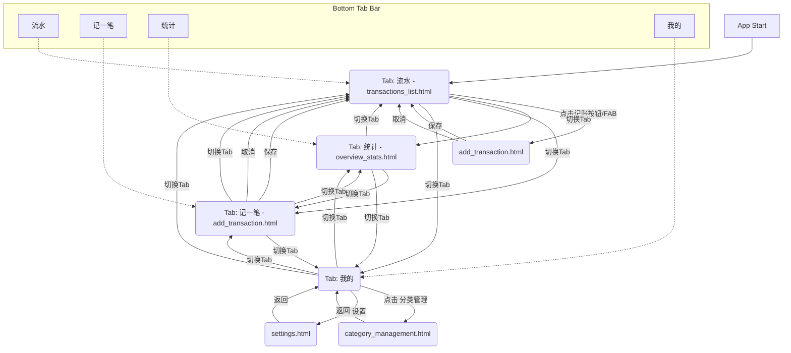

# 个人记账 App 用户体验分析与产品界面规划

## 一、用户体验分析

### 1. 主要功能分析
这款个人记账 App 的主要功能可以概括为：
*   **快速记账**：用户能够便捷地记录每一笔收入或支出。
*   **查看流水**：用户可以按时间顺序浏览所有的交易记录。
*   **统计分析**：App 提供数据的汇总和可视化展示，帮助用户了解财务状况。
*   **分类管理**：用户可以对收支项目进行分类，并管理这些分类。

### 2. 用户核心需求
基于上述功能，用户的核心需求可以提炼为：
*   **便捷记录**：记账过程应尽可能简单快捷，减少用户操作负担。
*   **清晰展示**：财务数据（流水、统计）需要直观、易懂地呈现。
*   **财务概览**：用户希望能够快速了解自己的整体财务状况和消费习惯。
*   **灵活管理**：用户需要能够自定义收支分类，以适应个性化的记账需求。

### 3. 核心交互逻辑

*   **如何快速发起一笔记账？**
    *   **方案一（常见）：** 在底部 Tab Bar 设置一个突出的“记一笔”按钮（通常是中间位置的“+”号图标），点击后直接跳转到 `add_transaction.html` 页面。
    *   **方案二（备选）：** 在 `transactions_list.html` 页面设置一个悬浮操作按钮 (Floating Action Button, FAB)，点击后跳转到记账页面。
    *   **思考：** 方案一更直接，符合用户快速记账的预期。

*   **如何方便地切换查看不同时间范围的账单？**
    *   在 `transactions_list.html` 和 `overview_stats.html` 页面，通常会提供时间筛选控件。
    *   **控件形式：**
        *   **顶部标签页/分段控件：** 例如“本月”、“上月”、“本年”、“自定义范围”。
        *   **日历选择器：** 允许用户选择精确的开始和结束日期。
        *   **快捷切换：** 左右滑动或箭头按钮切换上一个/下一个时间单位（如上月/下月）。
    *   **思考：** 组合使用标签页进行快速切换常见时间范围，并提供日历选择器进行精确筛选，是比较全面的方案。

*   **如何进行分类筛选来查看特定类型的支出或收入？**
    *   在 `transactions_list.html` 页面，可以提供一个筛选器入口（例如漏斗图标）。
    *   点击筛选器后，弹出筛选条件设置界面，用户可以选择：
        *   **收支类型：** 收入、支出、全部。
        *   **分类：** 单选或多选一个或多个已定义的分类。
        *   **账户（若未来支持多账户）：** 选择特定账户的流水。
    *   在 `overview_stats.html` 页面，分类支出饼图本身就是一种按分类展示数据的方式。点击饼图的某个部分，可以联动展示该分类下的详细支出列表或进一步分析。
    *   **思考：** 清晰的筛选入口和明确的筛选条件选项是关键。

## 二、产品界面规划

### 关键界面定义与信息架构

#### 1. `transactions_list.html` (交易流水列表页)
*   **主要功能：** 按时间倒序展示所有收支记录。
*   **信息架构/主要元素：**
    *   **顶部导航栏：**
        *   页面标题（例如“账单流水”）。
        *   时间筛选控件（例如：月份选择器，或“本月”、“上月”等快捷标签，点击可展开更多选项如按年、自定义范围）。
        *   筛选按钮（漏斗图标），点击后可按分类、收支类型筛选。
        *   （可选）搜索框，用于按备注关键词搜索。
    *   **交易列表区域：**
        *   按日期分组展示，日期作为小标题。
        *   每条记录显示：
            *   分类图标和名称。
            *   备注（若有）。
            *   金额（支出用红色或负号，收入用绿色或正号）。
            *   （可选）交易时间（时:分）。
        *   点击单条记录可跳转到交易详情页（或直接编辑该条记录，取决于交互设计）。
    *   **（可选）底部汇总信息：** 当日或当月总收入、总支出、结余。
    *   **（可选）FAB 按钮：** “记一笔”的快捷入口（如果底部 Tab Bar 没有专门的记账按钮）。

#### 2. `add_transaction.html` (记一笔表单页)
*   **主要功能：** 用户输入金额、选择收支类型、选择分类、选择日期、填写备注等。
*   **信息架构/主要元素：**
    *   **顶部导航栏：**
        *   页面标题（例如“记一笔”）。
        *   “保存”按钮。
        *   “取消”或“返回”按钮。
    *   **表单区域：**
        *   **金额输入框：** 数字键盘，支持小数点。
        *   **收支类型选择：** 标签页或分段控件（“支出”、“收入”，未来可扩展“转账”）。
        *   **分类选择：**
            *   点击后弹出分类选择列表（可包含常用分类快速选择，以及“全部分类”入口）。
            *   选择分类后显示分类图标和名称。
            *   （可选）“添加新分类”的快捷入口。
        *   **账户选择（为未来多账户预留）：** 点击后弹出账户选择列表。默认为常用账户。
        *   **日期选择：** 默认为当天，点击后弹出日历控件供选择。
        *   **时间选择（可选，若需要精确到时分）：** 默认为当前时间，点击后弹出时间选择控件。
        *   **备注输入框：** 多行文本输入。
        *   **（可选）图片/票据上传功能。**
        *   **（可选）重复设置：** 例如“每日”、“每周”、“每月”的重复记账。

#### 3. `overview_stats.html` (概览与统计页)
*   **主要功能：** 展示用户的收支汇总、月度/年度趋势图、分类支出饼图等。
*   **信息架构/主要元素：**
    *   **顶部导航栏：**
        *   页面标题（例如“统计概览”）。
        *   时间范围选择器（例如：“本月”、“上月”、“本年”、“自定义”）。
    *   **概览卡片区域：**
        *   **总收入：** 显示选定时间范围内的总收入金额。
        *   **总支出：** 显示选定时间范围内的总支出金额。
        *   **结余：** 总收入 - 总支出。
    *   **图表展示区域：**
        *   **收支趋势图（折线图/柱状图）：**
            *   按日/周/月展示选定时间范围内的收入和支出变化趋势。
            *   X轴为时间，Y轴为金额。
        *   **分类支出饼图/环形图：**
            *   展示选定时间范围内，不同支出分类的占比。
            *   点击某个分类扇区，可以高亮并显示具体金额和百分比，或跳转到该分类的详细支出列表。
        *   **（可选）分类收入饼图/环形图。**
        *   **（可选）收支对比柱状图：** 按月或按年对比收入和支出。
    *   **（可选）预算模块：** 如果App支持预算功能，此处可以展示预算使用情况。
    *   **（可选）资产负债模块（为未来扩展）：** 展示总资产、总负债、净资产。

#### 4. `category_management.html` (分类管理页)
*   **主要功能：** 用户查看、添加、编辑、删除收支分类，并可以为分类设置图标。
*   **信息架构/主要元素：**
    *   **顶部导航栏：**
        *   页面标题（例如“分类管理”）。
        *   “添加新分类”按钮（例如“+”图标）。
    *   **分类列表区域：**
        *   **支出分类列表：**
            *   每行显示：分类图标、分类名称。
            *   操作按钮：编辑、删除（通常通过左滑或长按出现）。
            *   （可选）拖拽排序功能。
        *   **收入分类列表：** （与支出分类结构类似，或通过Tab切换）
    *   **添加/编辑分类弹窗/页面：**
        *   分类名称输入框。
        *   图标选择器（提供一组预设图标供选择，或支持自定义上传）。
        *   （可选）设置父分类（用于二级分类）。
        *   保存/取消按钮。

#### 5. `settings.html` (设置页)
*   **主要功能：** 包括账户管理、数据导出、App 外观设置、以及“关于我们”等信息。
*   **信息架构/主要元素：**
    *   **顶部导航栏：**
        *   页面标题（例如“设置”）。
    *   **设置项列表（通常为列表形式，每项一个入口）：**
        *   **账户管理（为未来多账户预留）：**
            *   点击进入账户列表页，可添加、编辑、删除账户（例如：现金、储蓄卡、信用卡、支付宝、微信钱包等）。
        *   **数据管理：**
            *   **数据导出：** 点击后选择导出格式（如 CSV, Excel），选择导出时间范围，执行导出操作。
            *   **数据导入（可选）：** 从指定格式文件导入数据。
            *   **数据备份与恢复（可选）：** 云备份或本地备份。
        *   **外观设置：**
            *   **暗黑模式开关：** 切换浅色/深色主题。
            *   **主题颜色选择（可选）：** 允许用户选择App的主题色。
            *   **字体大小（可选）。**
        *   **通知设置（可选）：**
            *   记账提醒。
            *   预算超支提醒。
        *   **安全与隐私（可选）：**
            *   密码锁定/指纹解锁。
            *   隐私政策。
        *   **帮助与反馈：**
            *   常见问题解答 (FAQ)。
            *   意见反馈入口。
        *   **关于我们：**
            *   App 版本号。
            *   开发者信息/联系方式。
            *   服务条款。
        *   **（可选）检查更新。**
        *   **（可选）退出登录（如果支持账户同步）。**

### 界面之间的导航关系与底部 Tab Bar 建议

采用底部 Tab Bar 是移动应用中非常成熟和用户友好的导航方式。建议 Tab Bar 包含以下项目，以覆盖核心功能且数量不宜过多（通常3-5个为佳）：

1.  **流水 (Transactions)**：对应 `transactions_list.html`。这是用户最常查看的界面之一。
    *   图标建议：类似列表或账单的图标。
2.  **记一笔 (Add)**：对应 `add_transaction.html`。这是核心操作，需要便捷入口。
    *   图标建议：通常是一个醒目的“+”号图标，可以设计得比其他 Tab 略大或有特殊样式。
3.  **统计 (Overview/Stats)**：对应 `overview_stats.html`。帮助用户了解财务状况。
    *   图标建议：类似图表（饼图、折线图）的图标。
4.  **我的 (Me/Settings)**：通常包含 `category_management.html` 的入口以及 `settings.html`。将不那么频繁但重要的管理和设置功能聚合在此。
    *   图标建议：类似人形轮廓或齿轮的图标。
    *   进入“我的”页面后，再通过列表项导航至“分类管理”、“账户管理”、“数据导出”、“外观设置”等具体页面。

**导航流程示例：**

*   用户打开 App，默认显示 **“流水”** 页面 (`transactions_list.html`)。
*   用户点击底部 Tab Bar 的 **“记一笔”**，跳转到 `add_transaction.html` 页面进行记账，完成后保存返回之前的页面（通常是“流水”页并刷新）。
*   用户点击底部 Tab Bar 的 **“统计”**，跳转到 `overview_stats.html` 查看财务分析。
*   用户点击底部 Tab Bar 的 **“我的”**，进入一个聚合页面，其中包含：
    *   “分类管理”入口 -> `category_management.html`
    *   “设置”入口 -> `settings.html` (或者将设置页内的主要项目直接平铺在“我的”页面，如账户管理、数据导出等)

### Mermaid 图表表示导航关系

## 三、总结文档

这份文档完成了个人记账 App 的用户体验分析和产品界面规划。主要内容包括：

1.  **用户体验分析：**
    *   **主要功能：** 快速记账、查看流水、统计分析、分类管理。
    *   **核心需求：** 便捷记录、清晰展示、财务概览、灵活管理。
    *   **核心交互：**
        *   快速记账：通过底部 Tab Bar 的突出按钮。
        *   时间范围切换：通过标签页和日历选择器。
        *   分类筛选：通过筛选器入口和明确的条件选项。

2.  **产品界面规划：**
    *   **`transactions_list.html`：** 顶部导航（时间筛选、条件筛选、搜索）、交易列表（按日期分组，显示分类、备注、金额）、可选底部汇总。
    *   **`add_transaction.html`：** 顶部导航（保存、取消）、表单（金额、收支类型、分类、账户、日期、备注、可选图片/重复）。
    *   **`overview_stats.html`：** 顶部导航（时间范围选择）、概览卡片（总收支、结余）、图表（收支趋势、分类支出饼图）。
    *   **`category_management.html`：** 顶部导航（添加分类）、分类列表（支出/收入，含编辑删除操作）、添加/编辑分类弹窗（名称、图标）。
    *   **`settings.html`：** 顶部导航、设置项列表（账户管理、数据管理、外观设置、通知、安全、帮助、关于）。
    *   **导航关系：** 建议底部 Tab Bar 包含“流水”、“记一笔”、“统计”、“我的”。“我的”页面作为聚合入口，导航至分类管理和设置等。

这份文档可以作为后续 UI 设计和 HTML 实现的依据。